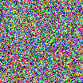
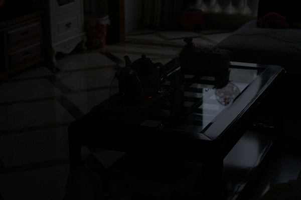
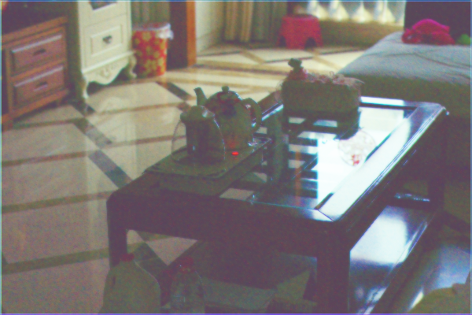

# LMCV
2023 CVPR "NoiSER: Noise is All You Need for Low-Light Image Enhancement"-Zhao Zhang, Suiyi Zhao, Xiaojie Jin, Mingliang Xu, Yi Yang, and Shuicheng Yan paper [NoiSER-Var3] Pytorch Implementation.

## Training Data

## Input and output

  
&nbsp; &nbsp; &nbsp; &nbsp;
  

